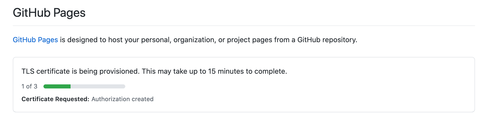

A website hosted on GitHub Pages is natively available at `https://<user>.github.io/<repo>`, but you can configure a custom domain for it.

There are four pieces to it:

- Purchase a domain from a registrar
- Point the registrar's DNS records at GitHub Pages
- Tell GitHub which host to expect, with a `CNAME` file in the published output
- Let GitHub provision a TLS certificate for it

## Buying a domain

I originally bought mine in 2020 from Google Domains, which had the best selection and lowest prices at
the time. Google had recently launched several of their own top-level domains —
`.page`, `.dev`, `.studio`, `.tech`, `.design` — and `.dev` fit a developer's web
presence best.

`.dev` is on the [HSTS preload list](https://hstspreload.org/), so it is *always*
served over HTTPS. Browsers refuse to load it over plain HTTP.

Google Domains no longer exists — in 2023 Google sold its registrar business to
Squarespace, and `brisberg.dev` moved with it. None of what follows depends on the
registrar; the records are the same everywhere.

## Pointing the domain at GitHub

GitHub hosts a "root" Pages site for a special repo named `<user>.github.io`, served
at `https://<user>.github.io`. Applying a custom domain to that repo applies it to
every other repo you host on Pages. The custom domain becomes canonical, and the
`github.io` address redirects to it:

```
https://<user>.github.io/<repo>  =>  https://mycustom.domain/<repo>
```

### Step 1: add DNS records at your registrar

Two records. Any DNS provider works the same way.

1. Apex `A` records pointing directly at the four GitHub Pages IP addresses. GitHub
   documents the current
   [set of addresses](https://docs.github.com/pages/configuring-a-custom-domain-for-your-github-pages-site).
2. A `CNAME` record for the `www` subdomain pointing at `<user>.github.io`.

Changes can take up to 48 hours to propagate, though in practice it was much faster.

One thing that did *not* work: Google Domains' built-in forwarding rules. They direct
to `ghs.googlehosted.com` instead of `<user>.github.io`, which Pages does not
recognize. Use plain resource records.

### Step 2: add a `CNAME` file to the published output

DNS gets traffic to GitHub's servers, but GitHub still serves thousands of sites from
those same four IPs. The `CNAME` file is how it knows which one you meant.

At the root of your **published output** — not the repo root, unless those happen to
be the same place — add a plain text file named `CNAME` containing nothing but the
host:

```
mycustom.domain
```

If you build with a static site generator, this file has to survive the build. Put it
wherever your generator copies static assets from verbatim.

### Step 3: enable HTTPS

In **Repo Settings → Pages**, turn on **Enforce HTTPS**. GitHub provisions a Let's
Encrypt certificate automatically. The UI promises up to 15 minutes; mine took closer
to 30, and the progress indicator sits on step 1 of 3 for most of it.



## Subdomains for other project repos

Once the root Pages repo is set up, every other repo you publish to Pages is
automatically reachable under the custom domain as a path — `https://mycustom.domain/<repo>`.
You get that for free; there is nothing to configure.

You can also give one of those repos a subdomain of its own. Do that and the
subdomain becomes the canonical address, with both path forms redirecting to it:

```
https://<user>.github.io/<repo>  =>  https://<repo>.mycustom.domain/
https://mycustom.domain/<repo>   =>  https://<repo>.mycustom.domain/
```

It takes the same two pieces as before, one on each side:

1. A `CNAME` **record** at your registrar for the subdomain, pointing at
   `<user>.github.io` — **not** at the repo path.
2. A `CNAME` **file** in that repo's published output, containing
   `<repo>.mycustom.domain`.

The file takes 15–60 minutes to take effect, after which you enable **Enforce HTTPS**
again and wait out another certificate provisioning round.

### When this is worth doing

Reserve subdomains for things that are genuinely a *different application* — their
own runtime, their own build, their own deploy. Two of mine qualify:

- [`twine.brisberg.dev`](https://twine.brisberg.dev) serves compiled Twine games.
  They are built artifacts fanned in from other repos, not pages.
- [`friday-fellows.brisberg.dev`](https://friday-fellows.brisberg.dev) is a web app
  backed by a cloud function.

Neither would make sense as a folder inside a content site.
